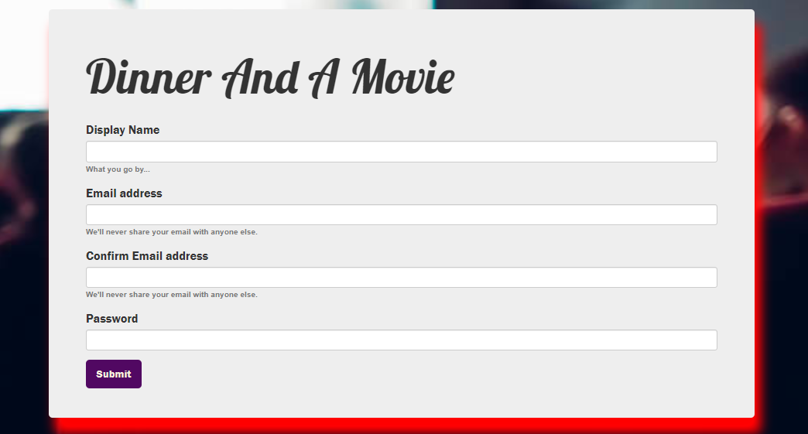

# Dinner_And_A_Movie
Dinner_And_A_Movie is a full-stack web application allowing users to search for recipes and movie options based on their interests and save them together for a perfect movie night with their family.   

 ## Description: 
 Stuck at home a lot more lately? Needs ideas for a perfect night in? This application will allow users to search for recipes and movie options based on their interests and save them together for a perfect movie night with their family. (We will be using 2 APIs to get information). Users will then pair their favorite movie search and dinner recipe option(s) searched from ingredients they have in their home.  If users would like to save a particular movie search, it can be saved and populated on their dashboard future reference.
 
 ## Table of Contents: 
  * Installation 
  * Usage 
  * License 
  * Contributing 
  * Questions 
  * Images 
   
   #### Installation: 

   npm install
   
   ### Technology: 
   * 
   * 
   * 
   * 
   * 

 
   
   #### License: 

   ISC: 
   
   ### Contributions: 
   
   * Karna Cutolo
   * Jasmin Rowdy
   * Shuyun Mu
   * Molly Nguyen
   
   

   ### Questions: 
   
   #### If you have any questions about this repo, please reach out: 

   * **Email: karna.cutolo@gmail.com**
   * **Email: jasminrowdy@gmail.com**
   * **Email: rtpice.mu@gmail.com**
   * **Email: nguyenvmolly@gmail.com**
     
   #### Images: 

   **Login Page**

   

   **SignUp Page**

   

   **Dinner-Movie Page**

   

